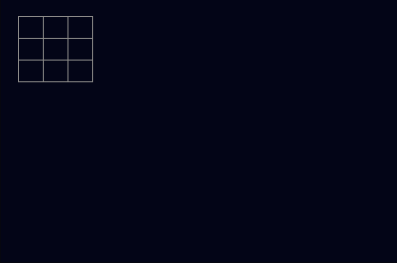
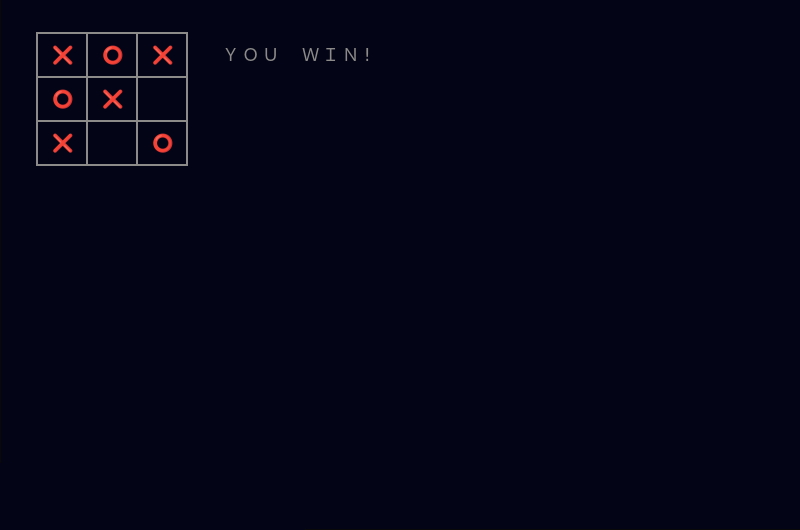

# Bash Noughts

<p align="center">
  
</p>


A Bash implementation of the old game *Noughts & Crosses*, also known as *Tic Tac Toe*, a very simple turn-based game of strategy played usually with a writing instrument and paper.

## Requirements

- Bash >= 4.3
- A UTF-8–capable, ANSI / VT100-compatible terminal emulator with Unicode glyph support (eg GNOME Terminal, Konsole, Tilix)

## Notes

This simple implementation of *Noughts & Crosses* takes advantage of the double-width 'emoji' characters supported in modern terminal emulators, and mouse control. It uses a left-clickis to select the next (square) move. 

## Installation

Download the script directly:

```bash
wget https://github.com/StarShovel/bash-noughts/raw/main/bash-noughts.sh
chmod +x bash-noughts.sh
```

Alternatively, clone the full repository:

```bash
git clone https://github.com/StarShovel/bash-noughts.git
cd bash-noughts
```

## Usage

Run the game from the command line:
```./bash-noughts.sh```

Or for "compromised mode" (see below):
```./bash-noughts.sh -c```

It looks its best when run on a terminal with a dark background, but this is not strictly necessary. It won't work at all on a terminal that doesn't support wide Unicode glyphs.

**IMPORTANT**: start the game in a terminal with dimensions 70x24 minimum. Most terminal emulators have a default of 80x24, and that will work nicely. Resizing while the script is running will break the game.


## Instructions

It is assumed that the user knows the rules of *Noughts & Crosses*. However: it's a simple game, played on a grid of nine squares. One player (in this case the human) is X (crosses) and the other (in this case the computer) is O.

Each player takes turns placing their mark (❌ or ⭕) into an empty square on the grid. In this implementation, the human player goes first. The first player to get **three of their marks in a row**, either horizontally, vertically, or diagonally, wins the game.

If all nine squares are filled and neither player has a row of three, it's a draw.

The initial screen looks like this:

<p align="center">
  
</p>
The human player makes his mark, ie an ❌, by left-clicking on the desired square.

In the default mode, it is not possible for the human to win. The best he or she can hope for is a draw. In "compromised" mode, it's possible for the computer to be defeated.

<p align="center">
  
</p>


### Author's Technical Note

In the late 1980s I was required to complete an Artificial Intelligence module as part of a Computer Science degree course, and to understand the [Minimax](https://en.wikipedia.org/wiki/Minimax) algorithm. This is a recursive method to search through a game tree to anticipate an opponent's best moves and calculate the optimal strategy. It assumes your opponent will always make the optimum possible move, using the same code intended to determine your own move. The objective is flipped as the algorithm recurses, depending on whose turn is being analysed.

The 3x3 Noughts & Crosses board has a tiny state space and is a "solved game" that can be completely analysed from start to finish. When a computer runs the Minimax algorithm, it maps out every possible permutation. It is mathematically impossible for a human opponent to win against a computer using this method; the best a human can hope to achieve is a draw. For this reason I have incorporated an optional "compromised" mode (more on this below).

The first, prototype version of this code used the Minimax method in its simplest form. My first observation was that the computer's first move took a long time. It has to examine thousands (40,320 worst case) of possible game paths. Subsequent responses are much quicker - with only 6 empty places left for example, ie the computer's second move, the very worst case is 720 game paths.

If I'd organised the game so that the computer took the first move, it might have to analyse 362,880 (9!) game paths. But in any case with 8 empty squares, the time taken for the computer to arrive at its first move on my hardware was about 10 seconds.  I fixed this, initially, by implementing a lookup table of optimal first computer moves, to respond to each of the nine first human moves.

#### Caching

However: I realised that even the computer's later moves are in a way very inefficient - in that it will analyse the same board multiple times, even in the same move - because there are sometimes several different ways to arrive at it.

When it is evaluating the "game tree" for a particular sequence of moves, the computer will recursively look possibly thousands of moves into the future to score the board. Then when it backs up and evaluates the branch for an alternative sequence, it forgets the scores for boards it's seen before and will blindly re-calculate the entire future tree again.

There's an easy fix for this, though. I set up an associative array as a cache. So when the board scoring routine assesses a score for a board embodying a particular potential move, it saves the score for that board. A board is represented as a simple string of digits with 0 for an empty space, 1 for the human's mark (an X) and 9 for the computer's mark (a 0). Like 191999011, for example.

Happily, after testing, it turned out that the caching defeats the first computer move delay, and I didn't need to set up a lookup for its first move. So I removed the first move lookup code.

I did some diagnostics with updates to a log file, and found that the cache never gets updated after the computer's first move - because the first time the Minimax algorithm runs, it explores every single legal combination of moves that can happen from that point until the end of the game. After that the cache is complete, so the Minimax algorithm only runs once.

#### Unpredictability Modification

The final modification I made to the basic Minimax algorithm was to have the computer pick from equal-scored moves at random. Just to make it a bit less predictable in some circumstances.

#### Compromised Mode

As noted earlier, the computer cannot be defeated when using the Minimax method in its traditional form. Therefore I coded a "compromised" mode in which the computer AI is only allowed to descend two levels of recursion to analyse a board. In practice this allows the human to win occasionally. See **Instructions** above.


---

## License

*Bash Noughts* is free software: you can redistribute it and/or modify it under the terms of the [GNU General Public License](LICENSE) as published by the Free Software Foundation, either version 3 of the License, or (at your option) any later version.

This program is distributed **without any warranty**; without even the implied warranty of **merchantability** or **fitness for a particular purpose**.

See the [LICENSE](LICENSE) file for details.
